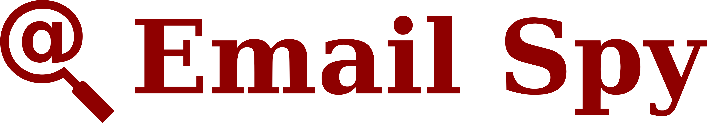

# Email Spy

## Development Setup

If you only need to use Email Spy as-is then it's much easier to just install the extension yourself from the Chrome web store.
These steps are only necessary if you would like to add custom functionality or contribute back to the project.

First, you will need both [node](https://nodejs.org/en/download/package-manager/) and [npm](https://docs.npmjs.com/getting-started/what-is-npm) (or [yarn](https://yarnpkg.com/en/), [pnpm](https://github.com/pnpm/pnpm), *etc.*) installed.
You can then clone the project and install the dependencies by running

```bash
git clone git@github.com:sangaline/email-spy.git
cd email-spy
npm install # or `yarn install`, `pnpm install`, etc.
```

The project can then be run in development mode with hot-reloading enabled using `npm run start` or build for production with `NODE_ENV=production npm run build`.
Both of these commands will output the extension in the `build/` subdirectory of the project.
The unpackaged extension will then need to be added to Chrome which can be done by following [these directions from Google](https://developer.chrome.com/extensions/getstarted#unpacked).
