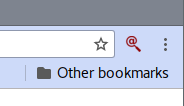
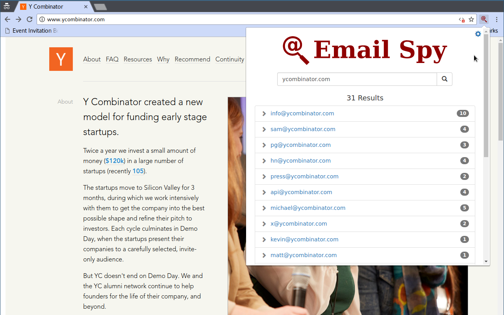
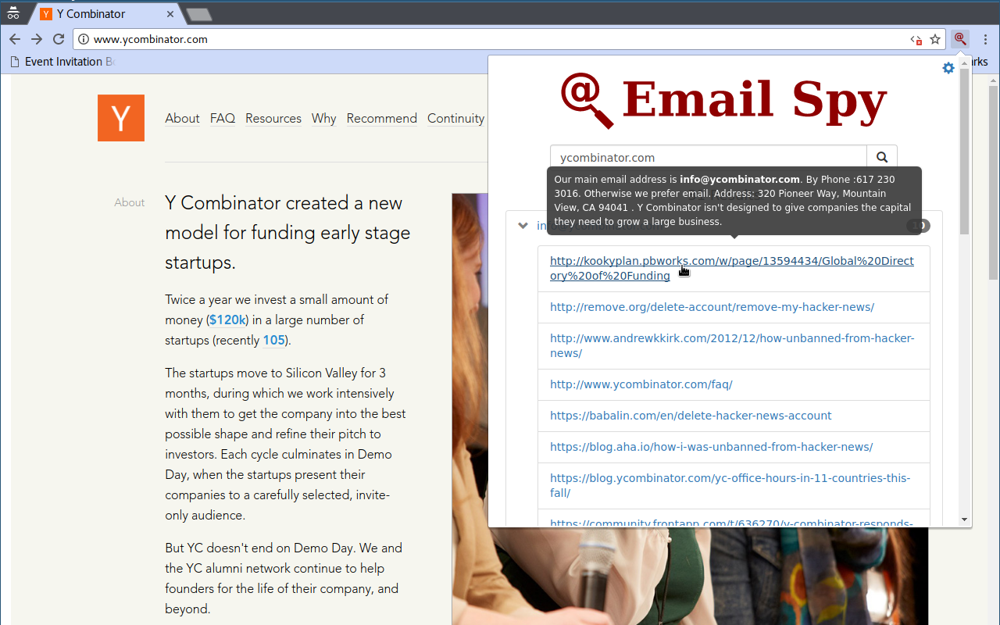
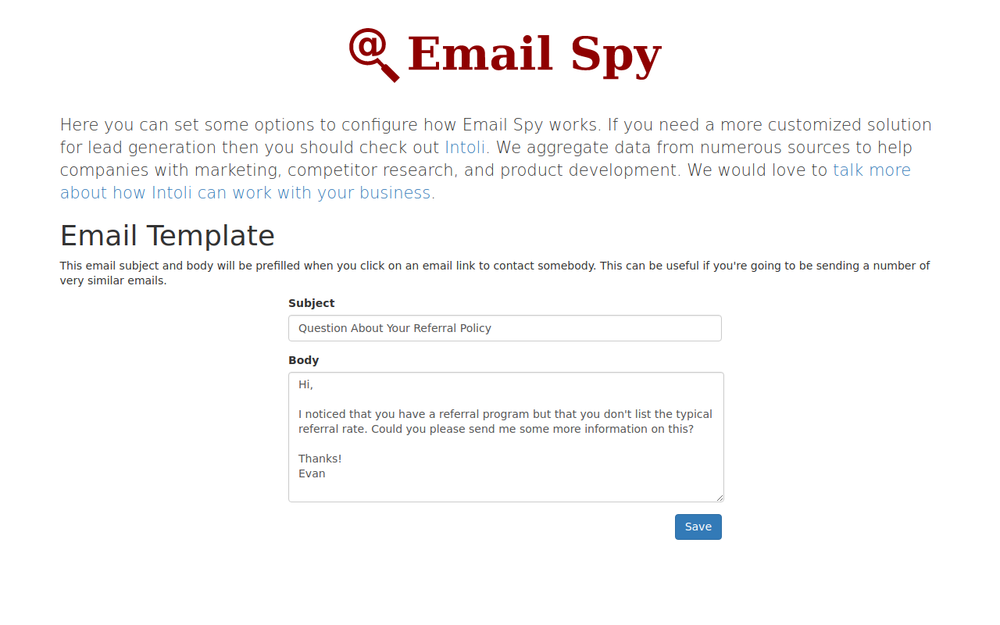

*If you need a more customized solution for lead-generation then you should check out [Intoli](https://intoli.com).*
*We aggregate data from numerous sources to help companies with marketing, competitor research, and product development.*
*We would love to [talk more about how Intoli can work with your business](https://intoli.com/contact).*


# Email Spy

Email Spy is a browser extension that lets you find email addresses for any domain with a single click.
This can be very useful when doing marketing and lead-generation research for your business.
Even if there's an easy to find contact email or form on a company's website, it is often much more effective to target your email to the correct person.

## Features

- Works with both Chrome and Firefox.
- Finds email addresses with a single click.
- Supports email templates to prepopulate email drafts.
- Completely free and open source.

## Installation

The extension can be installed drectly from the [Chrome Web Store](https://chrome.google.com/webstore/detail/iljlpblbhbalekegomdbbilibeahankm) for Google Chrome users and from the [Addons.Mozilla.Org](https://addons.mozilla.org/en-US/firefox/addon/email-spy/) for Firefox users (*note that the Firefox add-on is currently pending review by the Mozilla team*).
Microsoft Edge is not currently supported but it might be in the future if enough people express interest.

## Features and Usage

### Basic Usage

Once installed, the Email Spy extension will add an icon to the toolbar of your browser window that looks like this.



Clicking on the icon will begin a search for email addresses at the domain of the website that's open in the current browser tab.
The results look like this



and each email address is a `mailto:` link that will open in your email application.

The numbers next to each email address represent the number of references to that email address that were found.
Clicking on the expansion arrow to the left of an email address allows you to see a list of the URLs where the email address was referenced.
You can click on any of these URLs to open them in a new tab for further inspection or simply mouse over them to see a small snippet of context from the linked page.



### Advanced Usage

It can be convenient to use a basic email template as a starting point when you'll be sending a large number of similar emails.
Email Spy includes support for specifying an email template on its options page which can be opened either by right clicking on the toolbar icon and selecting `Options` or by clicking on the small gear icon in the upper right corner of the Email Spy results popup.



After entering and saving your email template, the subject and body of each email will automatically be filled for you when you click on an email address in the main results popup.

## Development Setup

If you only need to use Email Spy as-is then it's much easier to just install the extension yourself from the Chrome web store.
These steps are only necessary if you would like to add custom functionality or contribute back to the project.

First, you will need both [node](https://nodejs.org/en/download/package-manager/) and [npm](https://docs.npmjs.com/getting-started/what-is-npm) (or [yarn](https://yarnpkg.com/en/), [pnpm](https://github.com/pnpm/pnpm), *etc.*) installed.
You can then clone the project and install the dependencies by running

```bash
git clone git@github.com:sangaline/email-spy.git
cd email-spy
npm install # or `yarn install`, `pnpm install`, etc.
```

The project can then be run in development mode with hot-reloading enabled using `npm run start` or built for production with `NODE_ENV=production npm run build`.
Both of these commands will output the extension in the `build/` subdirectory of the project.
The unpackaged extension will then need to be added to Chrome which can be done by following [these directions from Google](https://developer.chrome.com/extensions/getstarted#unpacked).

## Contributing

Contributions are welcome but we ask that you create an issue before submitting a pull request.
